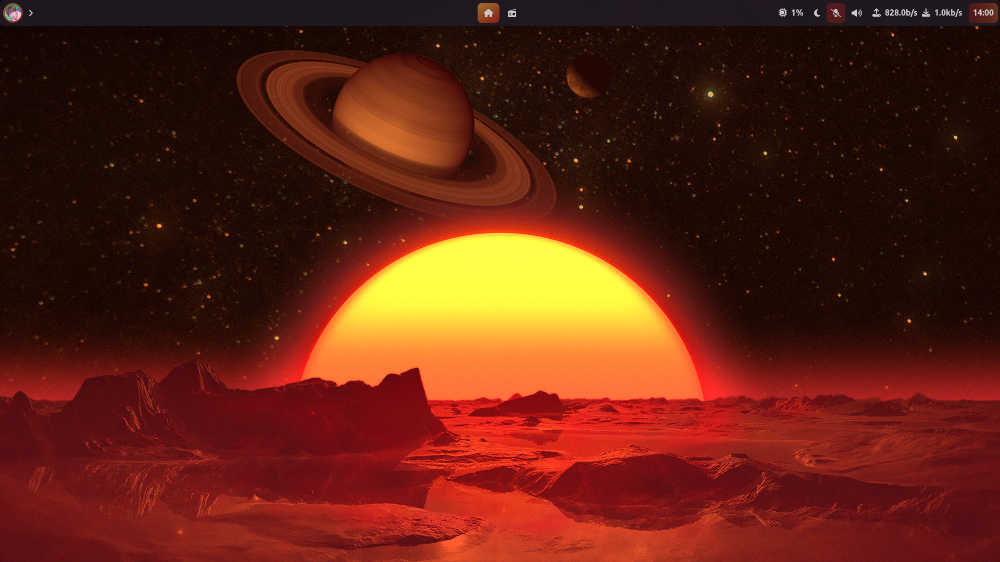
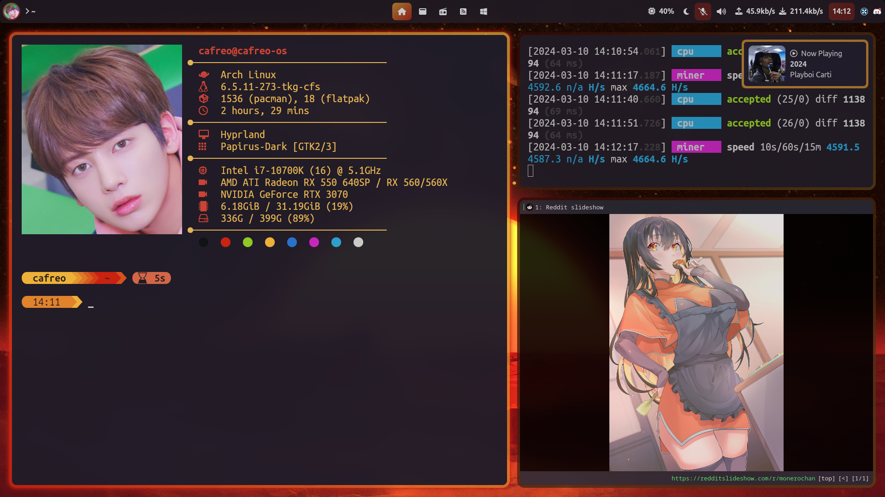
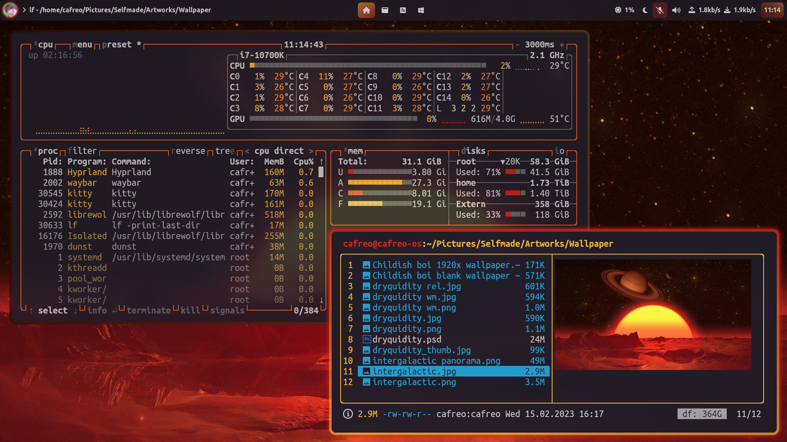
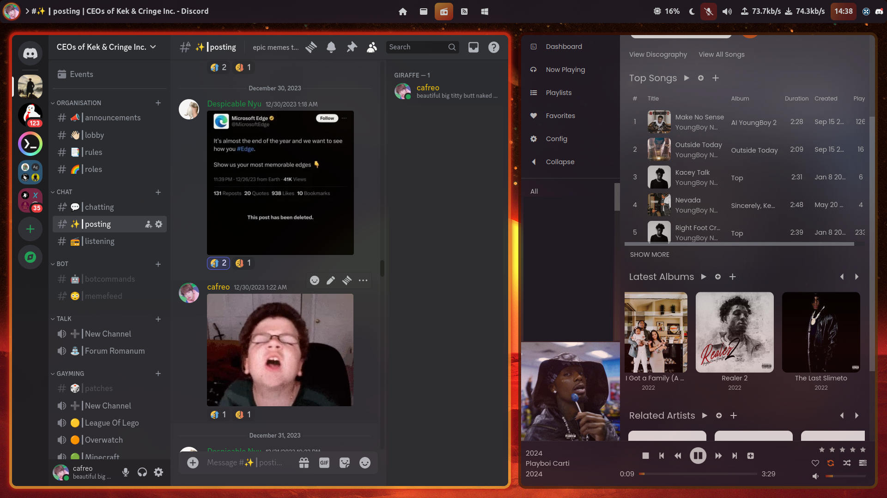
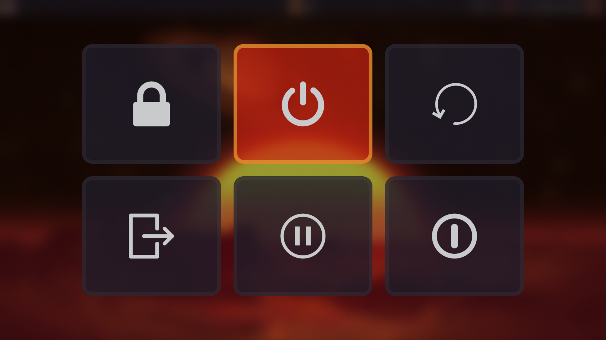

 <h1>intergalactic</h1>
 
config and style files for my hyprland intergalactic theme

 
<i>featuring the <a href="https://github.com/cafreo/hyprland-intergalactic/tree/main/dotconfig/lf">ultimate lf config</i></a>

 

 

 
 # screenshots
 
 ### desktop
 
 

 
 

 
 

 

 
 ### menus
 
  

 
 ### logout
 

 

 
 # system
 - os: [arch linux](https://archlinux.org)
 - wm: [hyprland](https://github.com/hyprwm/Hyprland)
 - term: [kitty](https://github.com/kovidgoyal/kitty)
 - shell: [bash](https://www.gnu.org/software/bash/)

 # apps
 - bar: [waybar](https://github.com/Alexays/Waybar)
 - menu: [rofi](https://github.com/davatorium/rofi) ([themes](https://github.com/adi1090x/rofi))
 - not: [dunst](https://github.com/dunst-project/dunst)
 - font: [ubuntu nerd](https://www.nerdfonts.com/font-downloads) / [ubuntu mono nerd](https://www.nerdfonts.com/font-downloads)
 - lock: [hyprlock](https://github.com/hyprwm/hyprlock)
 - power: [wlogout](https://github.com/ArtsyMacaw/wlogout)
 - night: [gammastep](https://gitlab.com/chinstrap/gammastep)
 - files: [lf](https://github.com/gokcehan/lf)

 # scripts
 - rofi: [file-selector](https://gitlab.com/matclab/rofi-file-selector/-/tree/master/), [screenshot](https://github.com/cafreo/hyprland-intergalactic/blob/main/scripts/rofi/rofi-screenshot.sh), [networkmanager](https://github.com/cafreo/hyprland-intergalactic/blob/main/scripts/rofi/rofi-networkmanager.sh)
 - notify: [hyprpicker](https://github.com/cafreo/hyprland-intergalactic/blob/main/dotconfig/notify-send/scripts/notify_hyprpicker.sh), [playerctl](https://github.com/cafreo/hyprland-intergalactic/blob/main/dotconfig/notify-send/scripts/notify_playerctl.sh), [volumectl](https://github.com/cafreo/hyprland-intergalactic/blob/main/dotconfig/notify-send/scripts/notify_volumectl.sh)

 # misc

 - startpage: [my own](https://github.com/cafreo/startpage)
 - colorscheme: [nvim](https://github.com/cafreo/intergalactic.nvim )

 # to do
 - [ ] eww/ags bar
 - [x] switch from micro to neovim
 - [x] dolphin rice
 - [ ] combine rofi themes into one file (sorta kinda done)
 - [x] screenshot menu
 - [ ] hyprdots port

 # credits
thanks to [chris titus tech](https://github.com/ChrisTitusTech) for making me switch to arch and hyprland with his [hyprland-titus](https://github.com/ChrisTitusTech/hyprland-titus) project, [eric murphy](https://github.com/ericmurphyxyz) for getting some of the scripting done, [learn linux tv](https://www.youtube.com/channel/UCxQKHvKbmSzGMvUrVtJYnUA) for his [bash scripting tutorial series](https://www.youtube.com/playlist?list=PLT98CRl2KxKGj-VKtApD8-zCqSaN2mD4w) and all the developers of the projects that are listed above.
