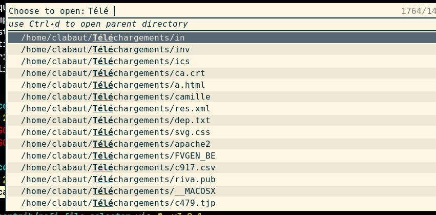

# Rofi file selector

This is a set of script and python program that allow to quickly find and open
a file for which you know part of the name.




## Features

- search in whole `$HOME` or in several set of directories.
- choose the application use to open the file
- Allow to set the default application for this file type (`Ctrl + +`)
- Cache the file list in order to allow for fast searching (except for the
  first time).

## Requirements
- rofi >= 1.6.0
- bash >= 4.3 *(need to declare indirection variables)*.
- python >= 3.7
- PyGObject *(see next section)*
- [fd, the fast find](https://github.com/sharkdp/fd)
- [choose](https://github.com/theryangeary/choose), human-friendly and fast alternative to cut
- `xsel` in order to copy the path to the clipboard with `ctrl+c`

## Installation

Install the `PyGObject` package as described in the
[documentation](https://pygobject.readthedocs.io/en/latest/getting_started.html).

Clone this repository.

## Usage

Simply launch the script `rofi-file-selector.sh`.

You may also add a binding to some key in your i3 config:
```
## Applications // File search //  * ##
bindsym $mod+asterisk exec  ~/.config/rofi/scripts/rofi-file-selector/rofi-file-selector.sh 
```

## Configuration

The configuration is defined with the help of several bash arrays in the
`config.sh` file (located either in the script directory or in
`$XDG_CONFIG_HOME/rofi-file-selector`). An example is given in the `config.sh.example` file:
<!-- [$ config.sh](config.sh.example) as bash -->
```bash
#!/bin/bash
# MENU is the list of items that will be presented to the user
# Usefull when you have huge home directory which takes
# to long to scan and or when you want to be able to limit the search to some
# directories
# Defaults to :
# MENU=( home )
MENU=(personal work admin)

# For each item `X` defined in the MENU array, you have to define in `d_X` an
# array of directories which will be search for file with `fd`.
# You may also define `f_X` which is an array of file which will be added to
# the rofi menu.
# You may also define additional option to be passed to the `fd` tool in `o_X`
# arrays. See also `FD_OPTIONS` for global options.
#
# The array items will be subject to shell expansion.

d_personal=(~/Downloads ~/Documents ~/Models )
o_personal=(--exclude ~/Documents/tmp)
d_work=(~/work/projects/web-* ~/work/accounting/ ~/Downloads ~/Models)
o_work=(--exclude '*.pyc' --no-ignore)
f_work=(~/work/{til.md,account.ledger,time.ledger,log.md})
d_admin=(~/admin ~/Downloads /var/log/)

# Options pass to `fd` in addition to the one specified in `o_X` variables
FD_OPTIONS=(--follow --no-ignore)
```
